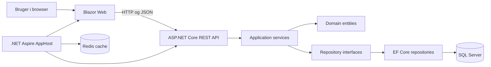

# Holmsgaard

Holmsgaard er en browserbaseret løsning til en håndværksvirksomhed. Systemet samler kunder, aktiviteter, medarbejdere, tidsregistrering og lager i én Blazor-applikation med et separat REST API.

## Status

Projektet kan bygges og testes fra solution-roden. Senest verificeret 2. august 2026:

- Build: gennemført uden fejl
- Tests: 26 bestået, 1 Aspire smoke test er midlertidigt sprunget over
- Kendt teknisk gæld: NuGet-sikkerhedsadvarsler og den deaktiverede Aspire smoke test

Den fulde eksamensstatus findes i [docs/exam-requirements.md](docs/exam-requirements.md), den prioriterede arbejdsplan findes i [docs/exam-backlog.md](docs/exam-backlog.md), og login-flowet forklares i [docs/authentication.md](docs/authentication.md). Docker-opsætningen forklares i [docs/docker.md](docs/docker.md), RowVersion-flowet i [docs/concurrency.md](docs/concurrency.md), og de seneste tekniske kontroller står i [docs/verification.md](docs/verification.md).

## Arkitektur



Solutionens projekter:

- `Holmsgaard.Web`: Blazor Web App med interaktive serverkomponenter
- `Holmsgaard.ApiService`: controllers, applikationsservices, domæne, repositories, EF Core og migrations
- `Holmsgaard.AppHost`: lokal orkestrering med .NET Aspire
- `Holmsgaard.ServiceDefaults`: health checks, service discovery og observability-standarder
- `Holmsgaard.Tests`: unit- og controller-tests

En mere detaljeret domænebeskrivelse findes i [docs/domain-architecture.html](docs/domain-architecture.html).

## Forudsætninger

- .NET 10 SDK
- SQL Server LocalDB
- Docker Desktop til Redis-containeren, når løsningen startes gennem Aspire
- Valgfrit: EF Core CLI-værktøjet `dotnet-ef`

Kontrollér installationen:

```powershell
dotnet --version
docker --version
```

## Klargør databasen

Connection string findes under `ConnectionStrings:HOLMSGAARD_CONTEXT` i API-projektets konfiguration. Standardopsætningen bruger SQL Server LocalDB.

```powershell
dotnet tool install --global dotnet-ef
dotnet ef database update --project Holmsgaard.ApiService
```

Hvis `dotnet-ef` allerede er installeret, kan første kommando springes over.

JWT-signing key må ikke ligge i Git. Opret en lokal nøgle med mindst 32 tegn:

```powershell
dotnet user-secrets set "Jwt:Key" "indsæt-en-lang-tilfældig-lokal-nøgle-her" --project Holmsgaard.ApiService
```

På denne computer er en tilfældig lokal nøgle allerede oprettet. Demo-login efter database migration:

- Email: `mikkel.svensson@hgaps.dk`
- Password: `HGAPS2026`

## Start med Docker Compose

Kopiér `.env.example` til `.env`, og udskift eksempelværdierne. Start derefter hele løsningen:

```powershell
docker compose up -d --build
docker compose ps
```

Åbn `http://localhost:5206`. Stop containerne uden at slette data:

```powershell
docker compose down
```

SQL Server- og Redis-data gemmes i Docker-volumes. Se alle porte og fejlsøgningskommandoer i [docs/docker.md](docs/docker.md).

## Start med Aspire

Som alternativ til Docker Compose kan løsningen startes gennem Aspire:

```powershell
dotnet run --project Holmsgaard.AppHost
```

Aspire-dashboardet åbner automatisk og viser de aktuelle adresser for `webfrontend`, `apiservice` og Redis. Ved direkte lokal kørsel bruger projekterne normalt disse adresser:

- Web: `http://localhost:5206`
- API: `http://localhost:5510`
- OpenAPI: `http://localhost:5510/openapi/v1.json`
- Aspire-dashboard: `https://localhost:17015`

## Build og test

Kør fra repository-roden:

```powershell
dotnet build Holmsgaard.slnx -p:UseAppHost=false
dotnet test Holmsgaard.slnx --no-build -p:UseAppHost=false
```

Smoke testen i `Holmsgaard.Tests/WebTests.cs` er markeret som skipped, fordi den venter forgæves på Aspire-resource health. Den skal repareres før endelig aflevering, så der findes en automatisk test af den samlede løsning.

## Centrale API-ruter

- `/api/customers`
- `/api/activities`
- `/api/employees`
- `/api/time-registrations`
- `/api/products`
- `/api/warehouse`
- `/api/auth/login`
- `/api/auth/register`
- `/api/auth/me` (kræver bearer token)

Ved login udsteder API'et et valideret JWT. Demonstrér authorization ved at kalde `GET /api/auth/me` først uden token og derefter med `Authorization: Bearer <token>`.
